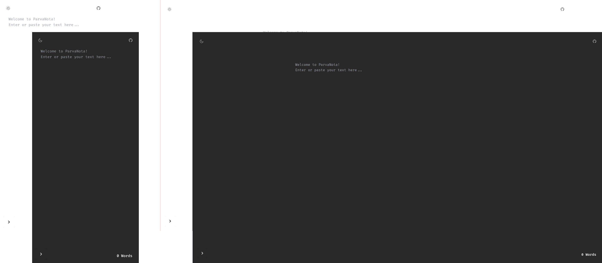

<h1 align="center">
    ParvaNota
</h1>

<p align="center">
    Small web application for basic text editing!
</p>

<p align="center">
  <a href="https://skillicons.dev">
    
  </a>
</p>

## Content Table

- [Deployment](#deployment)
- [Screenshots](#screenshots)
- [Requirements](#requirements)
- [Getting Started](#getting-started)
- [Features](#features)
- [Conventional Commits](#conventional-commits)
- [License](#license)
- [Contact](#contact)

## Deployment

🔗 [ParvaNota - Deployment](https://parvanota.vercel.app/)

## Screenshots



## Requirements

- `NodeJS v20.x`
- `npm v10.x`
- `Docker >= v28.0.0`

## Getting Started

Follow the step-by-step instructions to set up and run the application:

### Development Mode

1. Clone the repository:

   ```bash
   git clone https://github.com/Victor101106/ParvaNota.git
   ```

2. Install dependencies:

   ```bash
   npm install
   ```

3. Run the application in development mode:

   ```bash
   npm run dev
   ```

### Production Mode

1. Clone the repository:

   ```bash
   git clone https://github.com/Victor101106/ParvaNota.git
   ```

2. Install dependencies:

   ```bash
   npm install
   ```

3. Build the application:

   ```bash
   npm run build
   ```

4. Remove development dependencies:

   ```bash
   npm prune --production
   ```

5. Run the application in production mode:

   ```bash
   npm run start
   ```

### Production Mode with Docker

1. Clone the repository:

   ```bash
   git clone https://github.com/Victor101106/ParvaNota.git
   ```

2. Build and start the application container:

   ```bash
   docker compose up
   ```

## Features

- [x] Should allow users to view the entire text field;
- [x] Should allow users to edit the entire text field;
- [x] Should allow users to delete the entire text field.

### Word Count

- [x] Should allow users to view the word count of the text field under selection;
- [x] Should allow users to view the word count of the entire text field.

### Interface Themes

- [x] Should allow users to change the text field theme to system default;
- [x] Should allow users to change the text field theme to dark mode;
- [x] Should allow users to change the text field theme to light mode.

### Font Size

- [x] Should allow users to view the text field font size;
- [x] Should allow users to increase the text field font size;
- [x] Should allow users to decrease the text field font size.

### Data Persistence

- [x] Should allow users to persist the text field font size;
- [x] Should allow users to persist the text field theme.

### Clipboard

- [x] Should allow users to copy the entire text field;
- [x] Should allow users to paste the entire text field.

### Repository

- [x] Should allow users to access the application's source code repository.

## Conventional Commits

This project follows the [Conventional Commits](https://www.conventionalcommits.org/) specification to maintain a clean and consistent commit history.

### Message Structure

The commit message should be structured as follows:

```bash
<type>[optional scope]: <description>

[optional body]

[optional footer(s)]
```

#### Example:

```bash
feat(auth): add login functionality
```

## License

Distributed under the GPL v3.0 license. See [LICENSE](LICENSE.md) for more information.

## Contact

Victor Gabriel • [Github](https://github.com/Victor101106/) • victorgabriel101106+github@gmail.com
